# Laboratorio de Observabilidad

## Verificacion inicial del stack

En esta primera parte prepare el proyecto base, verifique los requisitos de Docker, corregi el ajuste necesario para mi entorno Linux y levante el stack de observabilidad con Docker Compose.

### Clonacion del proyecto

Clone el repositorio base del laboratorio dentro de mi carpeta local de trabajo:

```bash
git clone https://github.com/UPAO-Recursos/iac-observabilidad.git .
```

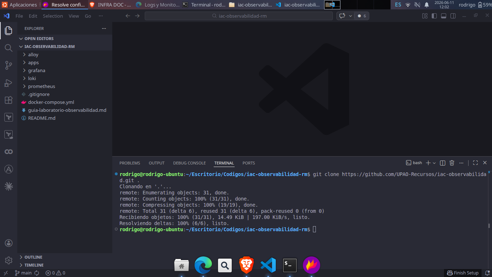

Luego confirme que Docker y Docker Compose estuvieran disponibles en mi maquina:

```bash
docker --version
docker compose version
```


### Ajuste inicial en Linux

Al ejecutar el stack por primera vez aparecio el siguiente error asociado al montaje de `node-exporter`:

```text
path / is mounted on / but it is not a shared or slave mount
```

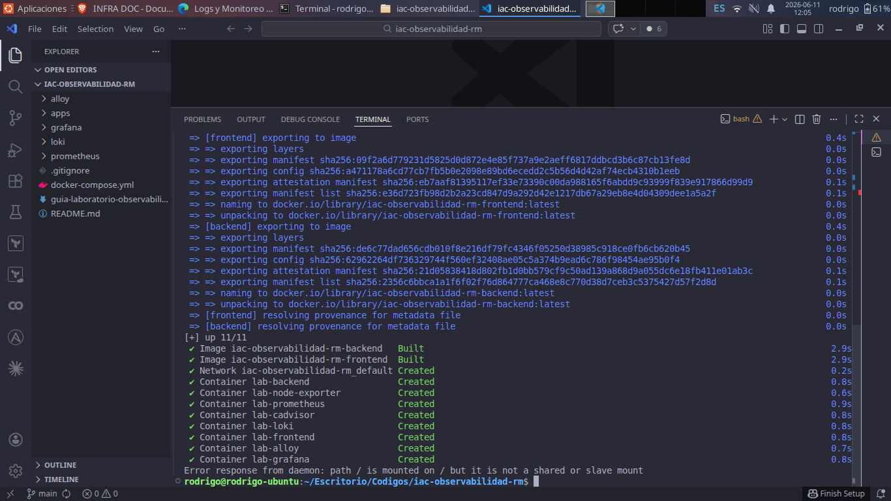

Revise el servicio `node-exporter` en `docker-compose.yml`. El volumen venia con la opcion `rslave`:

```yaml
- /:/host:ro,rslave
```


Para mi entorno Linux lo ajuste a:

```yaml
- /:/host:ro
```


Con ese cambio el stack pudo levantarse correctamente.

### Levantamiento del stack

Ejecute el comando principal del laboratorio:

```bash
docker compose up -d --build
```

La construccion de las imagenes del backend y frontend se completo correctamente.

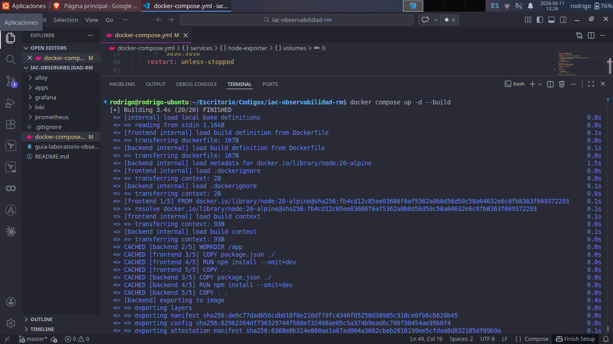

Al finalizar, Docker Compose creo y levanto los contenedores del laboratorio.


Despues verifique el estado general con:

```bash
docker compose ps
```

En la salida se observan los servicios principales arriba: `lab-backend`, `lab-frontend`, `lab-grafana`, `lab-prometheus`, `lab-loki`, `lab-alloy`, `lab-cadvisor` y `lab-node-exporter`.


Tambien deje registrado el commit local del ajuste de Linux:

```bash
git add docker-compose.yml
git commit -m "fix: corrige montaje de node exporter en linux"
```


### Servicios accesibles

Verifique el frontend en el navegador desde:

```text
http://localhost:8080
```

La pagina del laboratorio cargo correctamente y pude ejecutar el boton **Saludar (API)**, lo que confirma la comunicacion con el backend.

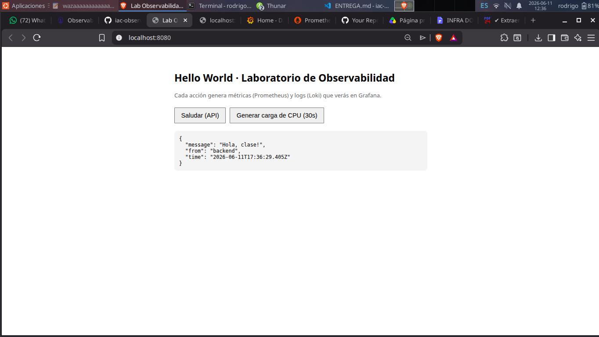

Tambien probe el boton de carga de CPU desde el frontend. Esta accion se usara mas adelante para validar la alarma de CPU.


Verifique el endpoint de metricas del backend en:

```text
http://localhost:3001/metrics
```

La respuesta muestra metricas en formato Prometheus, incluyendo metricas de CPU, memoria y estado del proceso del backend.

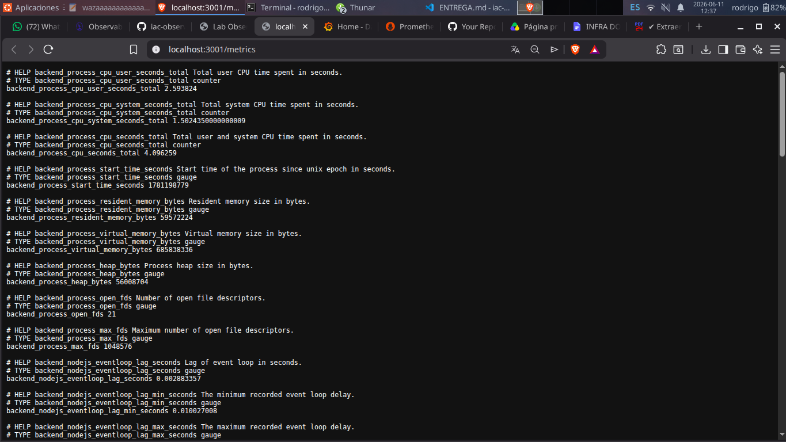

Verifique que Grafana estuviera accesible en:

```text
http://localhost:3000
```

Primero se muestra la pantalla de login.

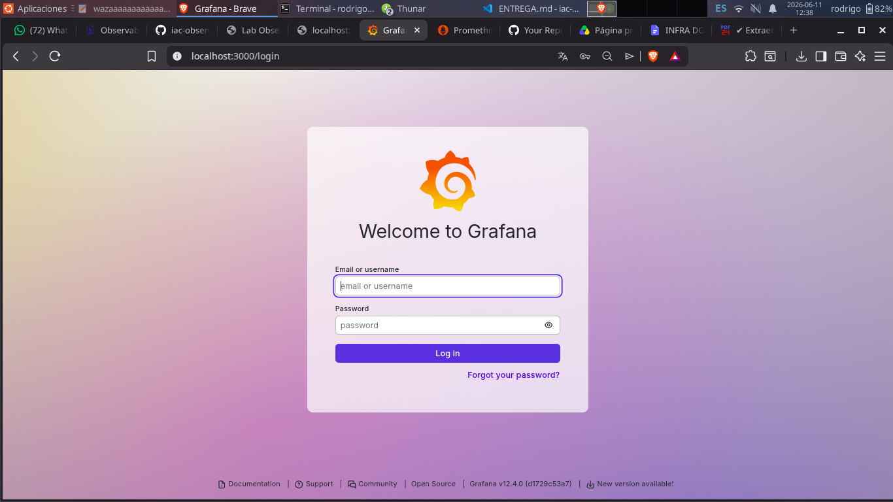

Luego ingrese con el usuario `admin` y confirme que Grafana cargara correctamente.


Finalmente, verifique que Prometheus estuviera disponible en:

```text
http://localhost:9090
```


Los servicios esperados para continuar el laboratorio son:

| Servicio | URL | Estado esperado |
|---|---|---|
| Frontend | `http://localhost:8080` | Pagina "Hello World" con botones |
| Backend | `http://localhost:3001/metrics` | Metricas en formato Prometheus |
| Grafana | `http://localhost:3000` | Login con usuario `admin` |
| Prometheus | `http://localhost:9090` | Interfaz web y consulta de targets |
| Loki | `http://localhost:3100` | Servicio de almacenamiento de logs |
| Alloy | `http://localhost:12345` | Estado del recolector de logs |
| cAdvisor | `http://localhost:8081` | Metricas de contenedores |
| node-exporter | `http://localhost:9100/metrics` | Metricas del host |

## Fuentes de datos en Grafana

Despues de levantar el stack, verifique que Grafana tuviera las fuentes de datos creadas por provisioning. En **Connections -> Data sources** aparecen **Prometheus** y **Loki**, por lo que no tuve que registrarlas manualmente desde la interfaz.

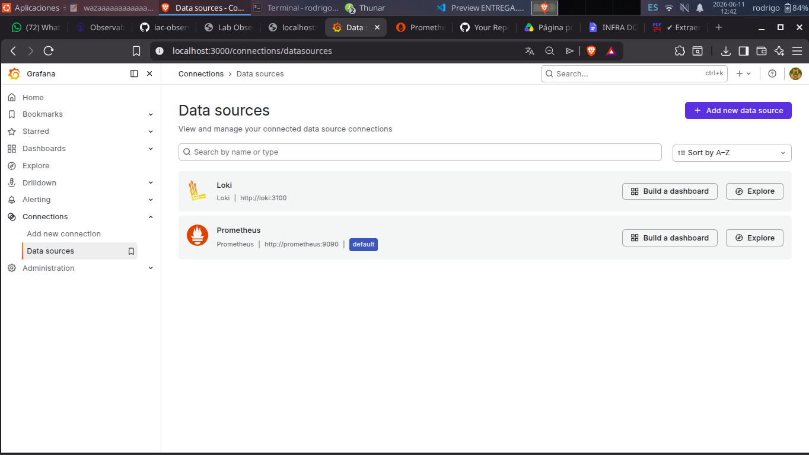

Tambien probe la conexion de Prometheus desde Grafana. La prueba fue correcta y confirma que Grafana puede consultar las metricas del stack.

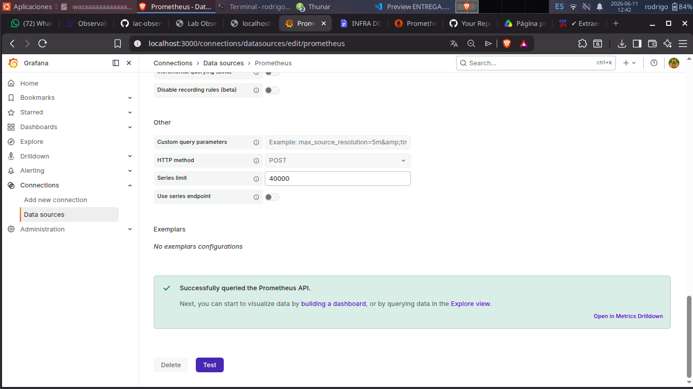

Luego hice la misma validacion con Loki. Esta prueba confirma que Grafana tambien puede consultar los logs recolectados por Alloy.

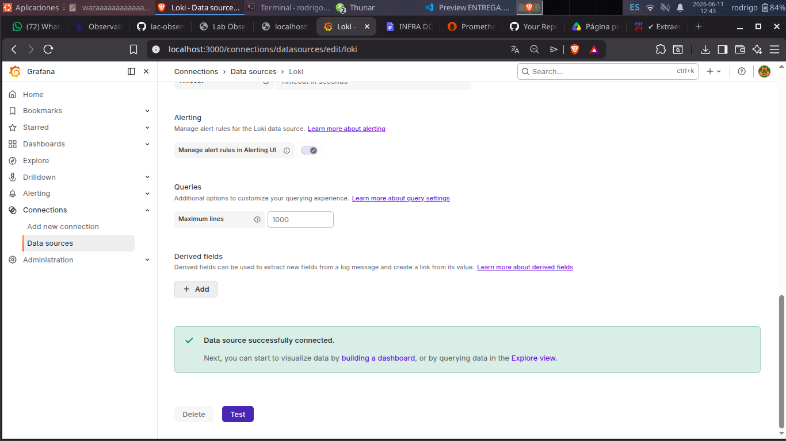

## Dashboard de metricas y logs

Cree un dashboard llamado **Observabilidad -- Rodrigo** con cuatro paneles: CPU del contenedor backend, CPU del host, logs de aplicacion y logs de infraestructura.

### CPU del contenedor backend

Primero intente usar la consulta base del laboratorio:

```promql
sum(rate(container_cpu_usage_seconds_total{name="lab-backend"}[1m])) * 100
```

En mi entorno esa consulta no devolvio datos porque cAdvisor no expuso la etiqueta `name` para el contenedor. Para mantener el objetivo del laboratorio, identifique el ID real del contenedor `lab-backend` con:

```bash
docker inspect -f '{{.Id}}' lab-backend
```

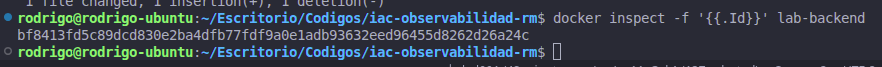

Con ese dato use la etiqueta `id` que si aparece en Prometheus:

```promql
sum(rate(container_cpu_usage_seconds_total{id="/docker/bf8413fd5c89dcd830e2ba4dfb77fdf9a0e1adb93632eed96455d8262d26a24c"}[1m])) * 100
```

Este panel muestra el consumo de CPU del contenedor backend. Lo configure como **Time series** y con unidad **Percent (0-100)**.

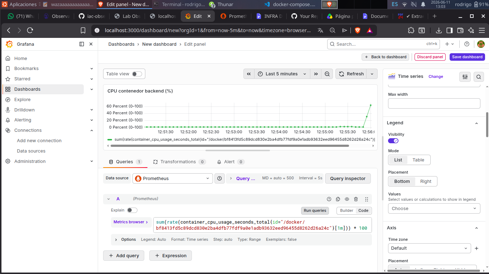

Tambien agregue el umbral en `50` para marcar visualmente cuando el backend supera el limite pedido en el laboratorio.

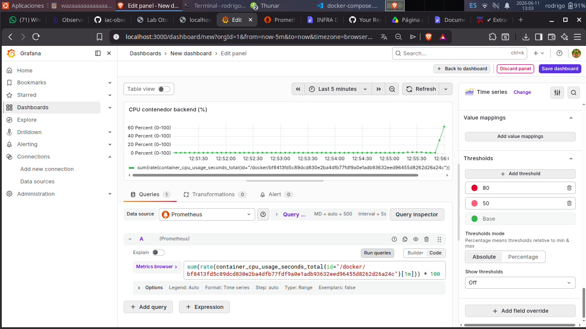

### CPU del host

Para la metrica de infraestructura general cree el panel **CPU del host (%)** con la consulta:

```promql
100 - (avg(rate(node_cpu_seconds_total{mode="idle"}[1m])) * 100)
```

Este panel representa el uso de CPU de la maquina completa, distinto al panel anterior que se enfoca solo en el contenedor del backend.

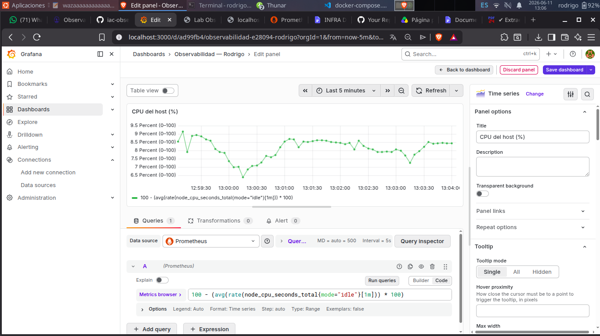

### Logs de aplicacion

Para los logs del frontend y backend use Loki con la consulta:

```logql
{tier="application"} | json
```

Con esta consulta pude ver logs JSON de las aplicaciones y campos como `level`, `service` y `msg`.

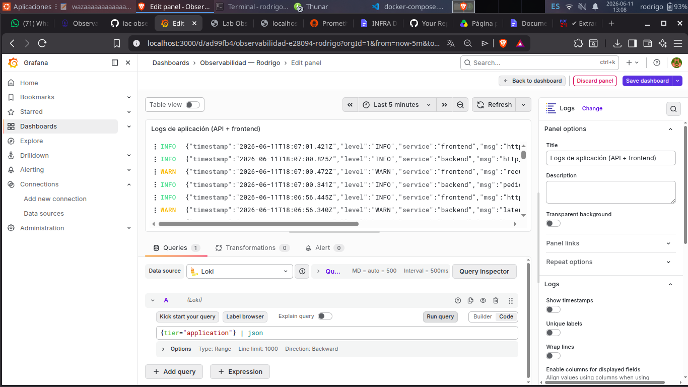

Tambien probe el filtro por nivel de error:

```logql
{tier="application"} | json | level="ERROR"
```

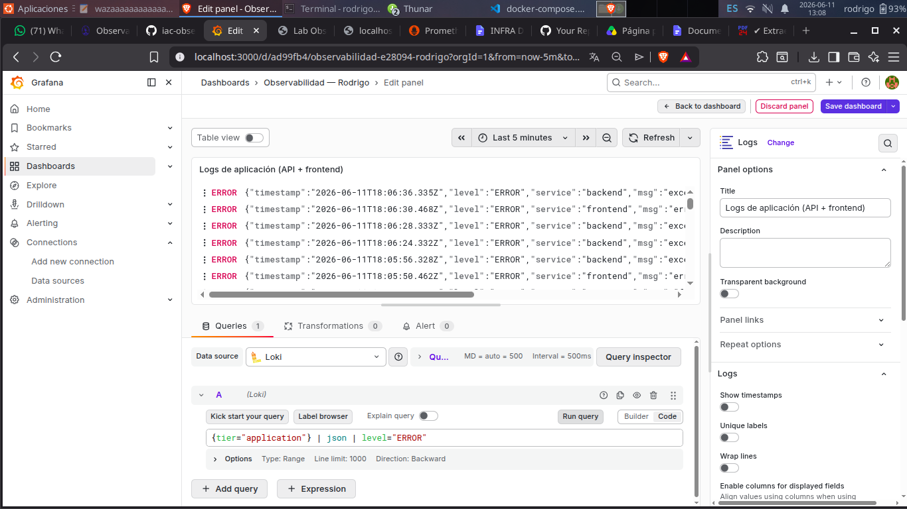

### Logs de infraestructura

Para los logs de infraestructura use la consulta:

```logql
{tier="infrastructure"}
```

Este panel muestra logs de servicios del stack como Grafana, Loki, Prometheus y los recolectores/exporters.

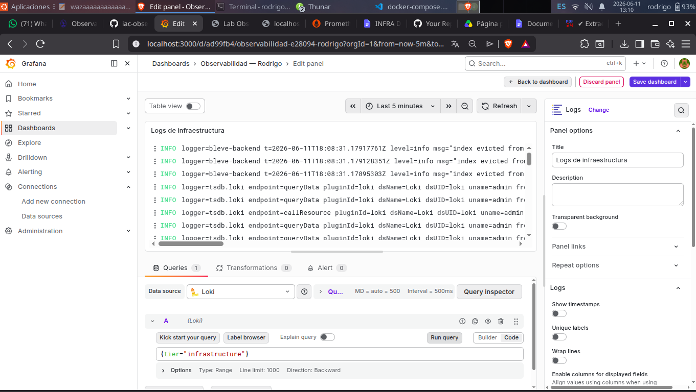

### Dashboard final

Finalmente guarde el dashboard con los cuatro paneles solicitados por la guia: dos de metricas y dos de logs.

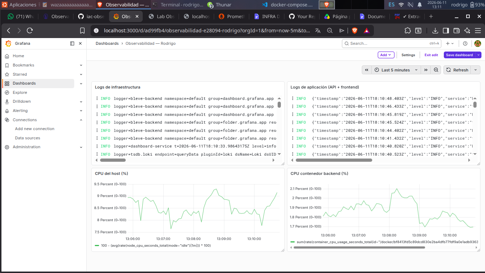

## Alarma de CPU del backend

Configure una regla de alerta en Grafana para validar el criterio de CPU mayor al 50%. La regla se llama **CPU backend > 50%** y usa Prometheus como fuente de datos.

La consulta propuesta en la guia usa `name="lab-backend"`, pero en mi entorno cAdvisor no expuso esa etiqueta. Por eso use la misma consulta validada en el dashboard, filtrando por el `id` real del contenedor backend:

```promql
sum(rate(container_cpu_usage_seconds_total{id="/docker/bf8413fd5c89dcd830e2ba4dfb77fdf9a0e1adb93632eed96455d8262d26a24c"}[1m])) * 100
```

La condicion de la alarma quedo como **IS ABOVE 50**, que equivale a disparar la alerta cuando el backend supera el 50% de CPU.

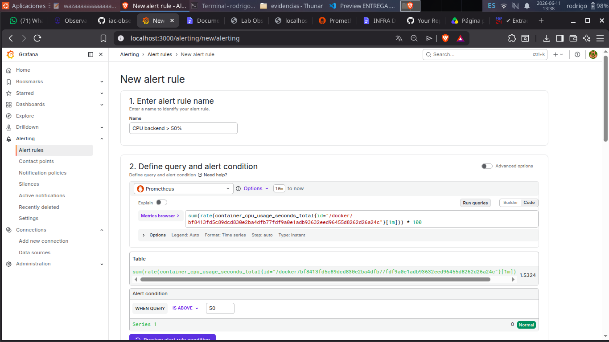

Luego ubique la regla dentro de la carpeta **Observabilidad**, agregue la etiqueta `severity = warning` y configure el grupo de evaluacion **Backend CPU Alerts** con intervalo de `10s`. Tambien configure el **Pending period** en `30s`.

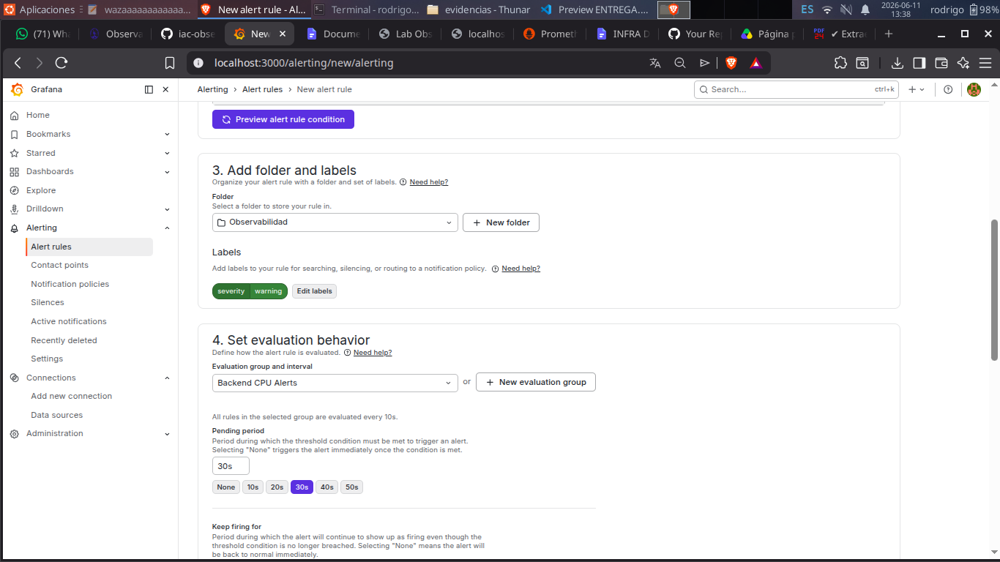

Para las notificaciones seleccione el contact point **Webhook Backend Lab**, que apunta al backend del laboratorio. Esto deja preparada la regla para el cierre del ciclo alarma -> log.

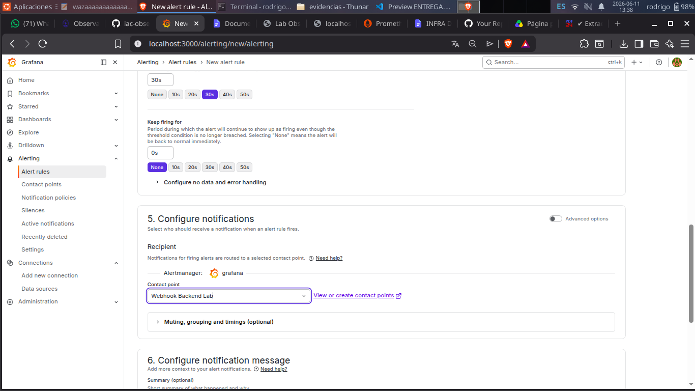

Finalmente guarde la regla desde Grafana.

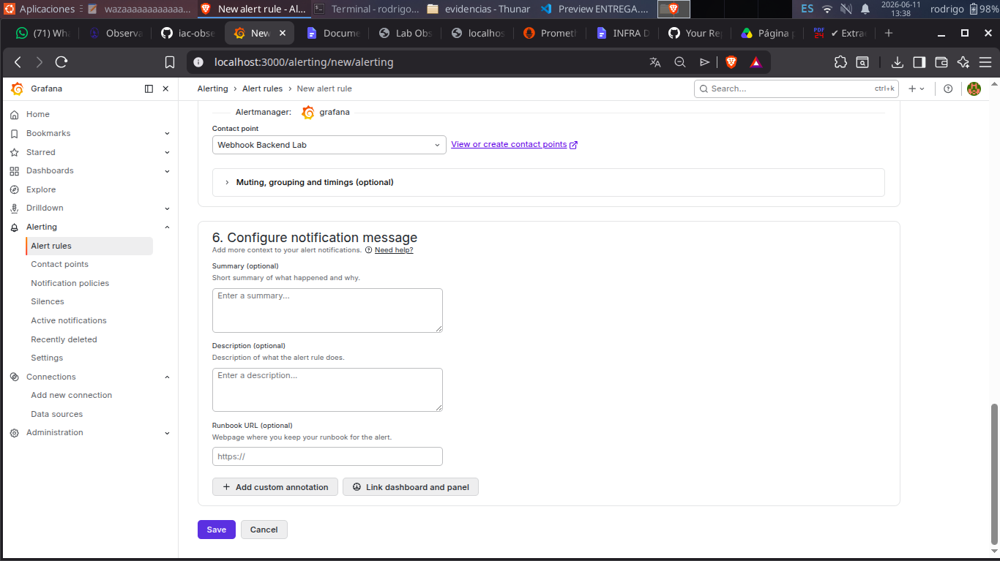

La regla quedo creada con intervalo de evaluacion de `10s`, etiqueta `severity = warning`, contact point configurado y condicion **A is above 50**.

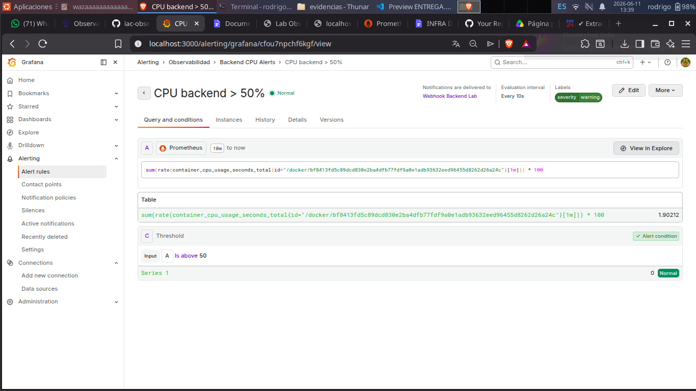

## Prueba de la alarma de CPU

Para validar la alarma genere carga de CPU sobre el backend desde el frontend del laboratorio. Durante la prueba, el panel **CPU contenedor backend (%)** supero el umbral de 50%, por lo que la condicion configurada en Grafana empezo a cumplirse.

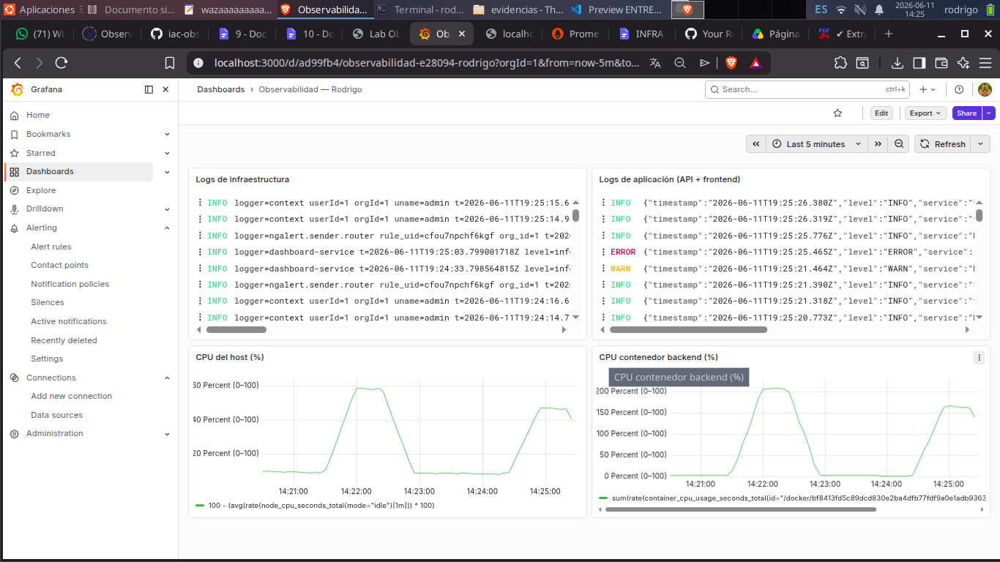

Luego revise la regla en **Alerting -> Alert rules**. Primero paso a estado **Pending**, respetando el pending period de `30s`.

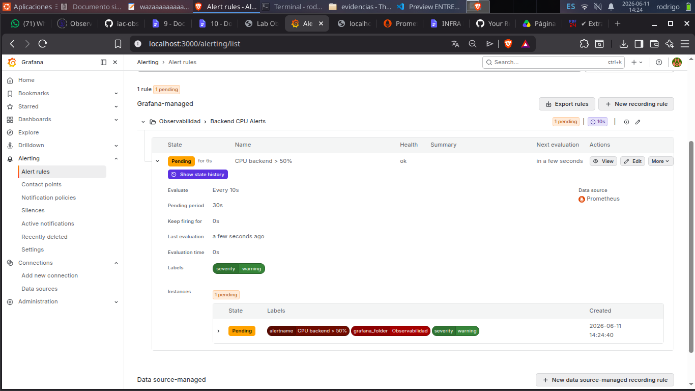

Despues de mantenerse sobre el umbral, la regla paso a estado **Firing**, que es la evidencia principal de que la alarma funciono correctamente.

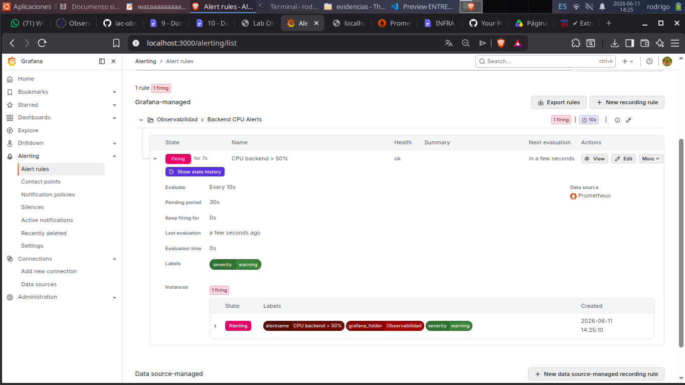

Cuando termino la carga de CPU, la metrica bajo nuevamente y la regla regreso a estado **Normal**.

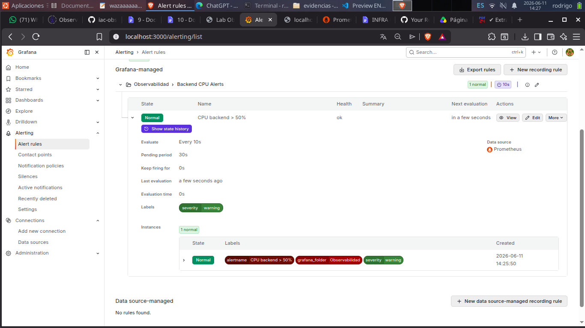

El historial de estados muestra el recorrido completo de la prueba: **Pending -> Alerting/Firing -> Normal**.

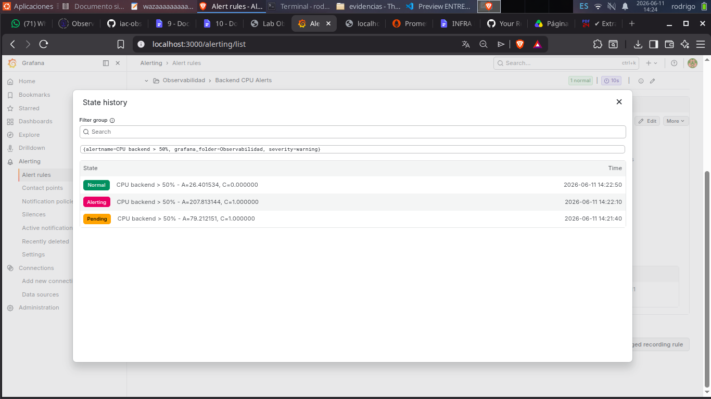

## Cierre del ciclo alarma a log

Para cerrar el ciclo configure la alerta con el contact point **Webhook Backend Lab**, apuntando a:

```text
http://backend:3001/alerts
```

Cuando la alerta entro en estado **Firing**, Grafana envio el webhook al backend. El backend recibio la notificacion y registro un log con el mensaje `grafana_alert_received`.

En la guia se menciona revisar el panel de logs de infraestructura; sin embargo, en este stack el webhook lo recibe el servicio `backend`, por lo que Alloy etiqueta ese evento como log de aplicacion (`tier="application"`). Por eso consulte el evento en Loki con:

```logql
{tier="application"} | json | msg="grafana_alert_received"
```

La captura muestra el log generado por el backend despues de recibir la alerta de Grafana. Con esto se evidencia el flujo completo: la metrica supera el umbral, Grafana dispara la alarma, envia el webhook y el backend genera un log observable en Loki.

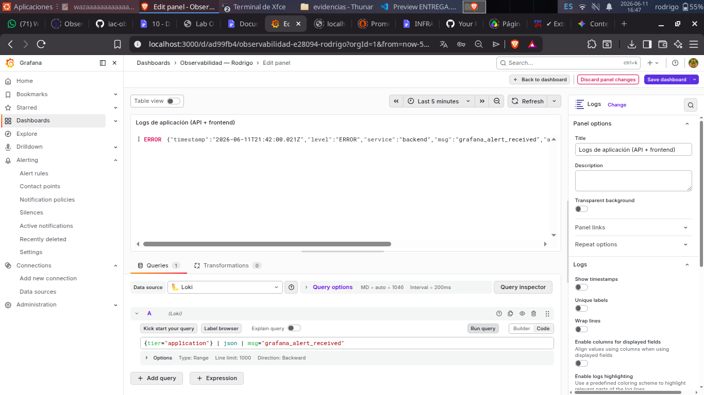

## Explicacion de componentes

Prometheus recolecta y almacena las metricas expuestas por las aplicaciones y los exporters.
Loki almacena los logs generados por los contenedores para consultarlos desde Grafana.
Grafana conecta las fuentes de datos, muestra dashboards y administra las reglas de alerta.
Alloy recolecta los logs de Docker y los envia a Loki con etiquetas como `tier`.
cAdvisor expone metricas de CPU y recursos por contenedor, como las del backend.
node-exporter expone metricas generales del host, como CPU de la maquina.
El frontend y el backend generan trafico, metricas y logs para comprobar el stack completo.
