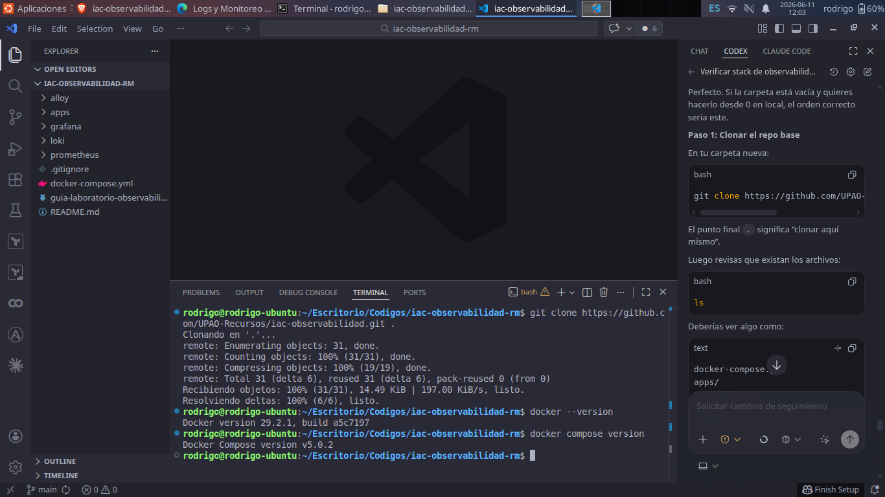
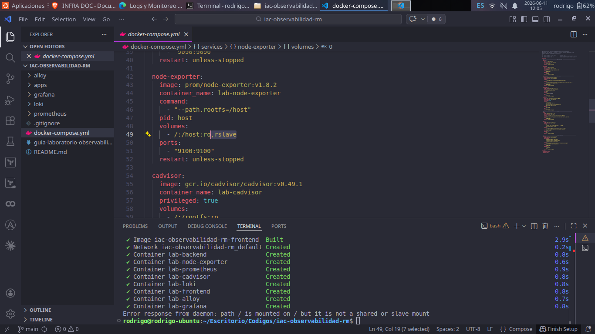
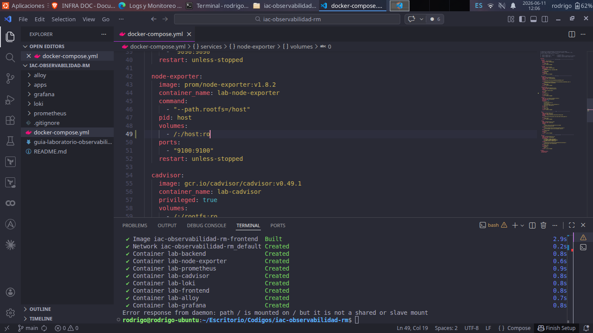
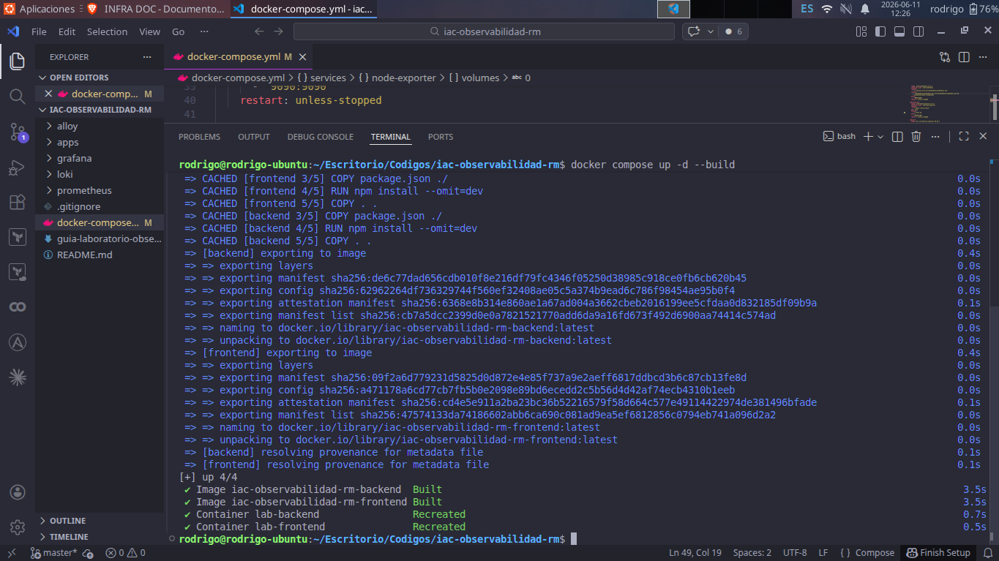
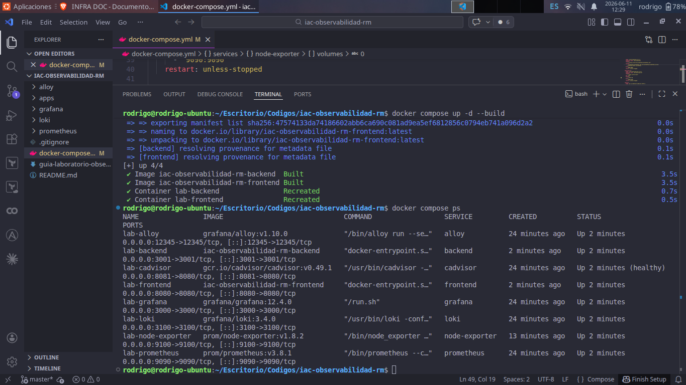
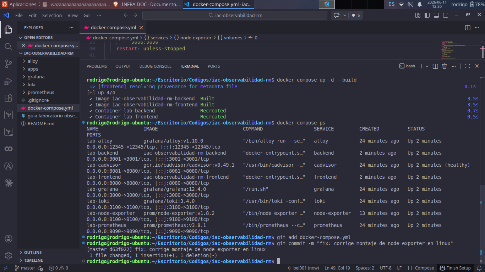
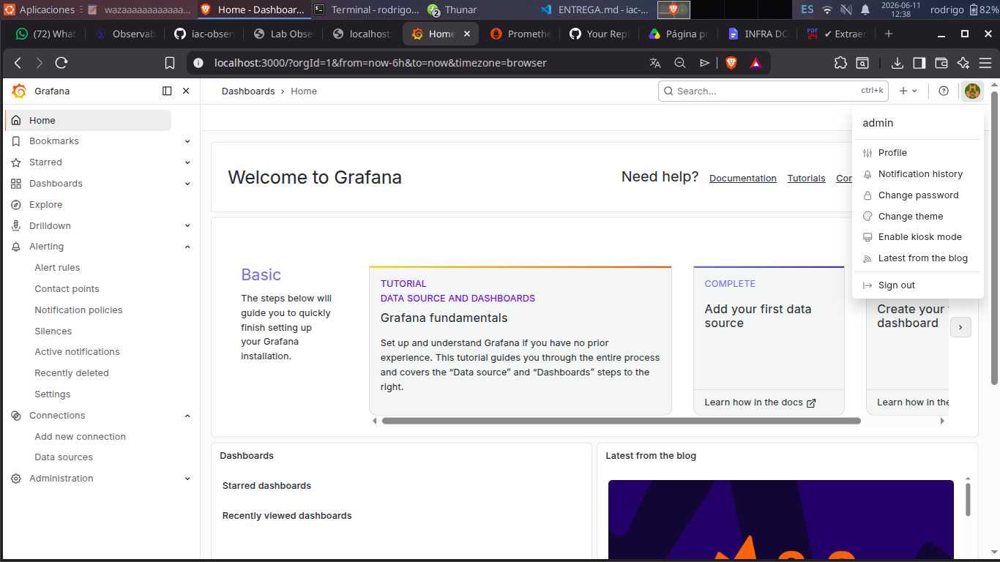
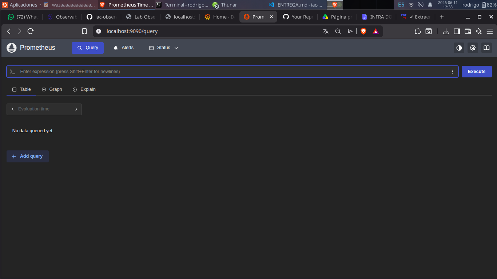

# Laboratorio de Observabilidad

## Verificacion inicial del stack

En esta primera parte prepare el proyecto base, verifique los requisitos de Docker, corregi el ajuste necesario para mi entorno Linux y levante el stack de observabilidad con Docker Compose.

### Clonacion del proyecto

Clone el repositorio base del laboratorio dentro de mi carpeta local de trabajo:

```bash
git clone https://github.com/UPAO-Recursos/iac-observabilidad.git .
```


Luego confirme que Docker y Docker Compose estuvieran disponibles en mi maquina:

```bash
docker --version
docker compose version
```



### Ajuste inicial en Linux

Al ejecutar el stack por primera vez aparecio el siguiente error asociado al montaje de `node-exporter`:

```text
path / is mounted on / but it is not a shared or slave mount
```


Revise el servicio `node-exporter` en `docker-compose.yml`. El volumen venia con la opcion `rslave`:

```yaml
- /:/host:ro,rslave
```



Para mi entorno Linux lo ajuste a:

```yaml
- /:/host:ro
```



Con ese cambio el stack pudo levantarse correctamente.

### Levantamiento del stack

Ejecute el comando principal del laboratorio:

```bash
docker compose up -d --build
```

La construccion de las imagenes del backend y frontend se completo correctamente.


Al finalizar, Docker Compose creo y levanto los contenedores del laboratorio.



Despues verifique el estado general con:

```bash
docker compose ps
```

En la salida se observan los servicios principales arriba: `lab-backend`, `lab-frontend`, `lab-grafana`, `lab-prometheus`, `lab-loki`, `lab-alloy`, `lab-cadvisor` y `lab-node-exporter`.



Tambien deje registrado el commit local del ajuste de Linux:

```bash
git add docker-compose.yml
git commit -m "fix: corrige montaje de node exporter en linux"
```



### Servicios accesibles

Verifique el frontend en el navegador desde:

```text
http://localhost:8080
```

La pagina del laboratorio cargo correctamente y pude ejecutar el boton **Saludar (API)**, lo que confirma la comunicacion con el backend.


Tambien probe el boton de carga de CPU desde el frontend. Esta accion se usara mas adelante para validar la alarma de CPU.


Verifique el endpoint de metricas del backend en:

```text
http://localhost:3001/metrics
```

La respuesta muestra metricas en formato Prometheus, incluyendo metricas de CPU, memoria y estado del proceso del backend.


Verifique que Grafana estuviera accesible en:

```text
http://localhost:3000
```

Primero se muestra la pantalla de login.


Luego ingrese con el usuario `admin` y confirme que Grafana cargara correctamente.



Finalmente, verifique que Prometheus estuviera disponible en:

```text
http://localhost:9090
```



Los servicios esperados para continuar el laboratorio son:

| Servicio | URL | Estado esperado |
|---|---|---|
| Frontend | `http://localhost:8080` | Pagina "Hello World" con botones |
| Backend | `http://localhost:3001/metrics` | Metricas en formato Prometheus |
| Grafana | `http://localhost:3000` | Login con usuario `admin` |
| Prometheus | `http://localhost:9090` | Interfaz web y consulta de targets |
| Loki | `http://localhost:3100` | Servicio de almacenamiento de logs |
| Alloy | `http://localhost:12345` | Estado del recolector de logs |
| cAdvisor | `http://localhost:8081` | Metricas de contenedores |
| node-exporter | `http://localhost:9100/metrics` | Metricas del host |
