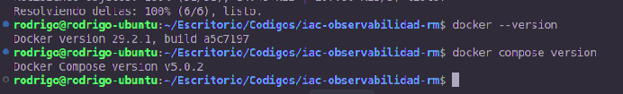

# Laboratorio de Observabilidad

## Verificación inicial del stack

En esta primera parte preparé el proyecto base, verifiqué los requisitos de Docker, corregí el ajuste necesario para mi entorno Linux y levanté el stack de observabilidad con Docker Compose.

### Clonación del proyecto

Cloné el repositorio base del laboratorio dentro de mi carpeta local de trabajo:

```bash
git clone https://github.com/UPAO-Recursos/iac-observabilidad.git .
```


Luego confirmé que Docker y Docker Compose estuvieran disponibles en mi máquina:

```bash
docker --version
docker compose version
```



### Ajuste inicial en Linux

Al ejecutar el stack por primera vez apareció el siguiente error asociado al montaje de `node-exporter`:

```text
path / is mounted on / but it is not a shared or slave mount
```


Revisé el servicio `node-exporter` en `docker-compose.yml`. El volumen venía con la opción `rslave`:

```yaml
- /:/host:ro,rslave
```


Para mi entorno Linux lo ajusté a:

```yaml
- /:/host:ro
```


Este ajuste fue necesario porque `node-exporter` necesita leer información del host desde el sistema de archivos raíz. En mi entorno Linux, el montaje original con `rslave` provocaba un error de Docker porque `/` no estaba configurado como un montaje compartido o esclavo. Al retirar esa opción, Docker pudo montar la ruta requerida en modo de solo lectura y el stack completo pudo levantarse sin detener la creación de los contenedores.

### Levantamiento del stack

Ejecuté el comando principal del laboratorio:

```bash
docker compose up -d --build
```

La construcción de las imágenes del backend y frontend se completó correctamente.


Al finalizar, Docker Compose creó y levantó los contenedores del laboratorio.


Después verifiqué el estado general con:

```bash
docker compose ps
```

En la salida se observan los servicios principales arriba: `lab-backend`, `lab-frontend`, `lab-grafana`, `lab-prometheus`, `lab-loki`, `lab-alloy`, `lab-cadvisor` y `lab-node-exporter`.


También dejé registrado el commit local del ajuste de Linux:

```bash
git add docker-compose.yml
git commit -m "fix: corrige montaje de node exporter en linux"
```


### Servicios accesibles

Verifiqué el frontend en el navegador desde:

```text
http://localhost:8080
```

La página del laboratorio cargó correctamente y pude ejecutar el botón **Saludar (API)**, lo que confirma la comunicación con el backend.


También probé el botón de carga de CPU desde el frontend. Esta acción se usará más adelante para validar la alarma de CPU.


Verifiqué el endpoint de métricas del backend en:

```text
http://localhost:3001/metrics
```

La respuesta muestra métricas en formato Prometheus, incluyendo métricas de CPU, memoria y estado del proceso del backend.


Verifiqué que Grafana estuviera accesible en:

```text
http://localhost:3000
```

Primero se muestra la pantalla de login.


Luego ingresé con el usuario `admin` y confirmé que Grafana cargara correctamente.


Finalmente, verifiqué que Prometheus estuviera disponible en:

```text
http://localhost:9090
```


Los servicios esperados para continuar el laboratorio son:

| Servicio | URL | Estado esperado |
|---|---|---|
| Frontend | `http://localhost:8080` | Página "Hello World" con botones |
| Backend | `http://localhost:3001/metrics` | Métricas en formato Prometheus |
| Grafana | `http://localhost:3000` | Login con usuario `admin` |
| Prometheus | `http://localhost:9090` | Interfaz web y consulta de targets |
| Loki | `http://localhost:3100` | Servicio de almacenamiento de logs |
| Alloy | `http://localhost:12345` | Estado del recolector de logs |
| cAdvisor | `http://localhost:8081` | Métricas de contenedores |
| node-exporter | `http://localhost:9100/metrics` | Métricas del host |

## Fuentes de datos en Grafana

Después de levantar el stack, verifiqué que Grafana tuviera las fuentes de datos creadas por provisioning. En **Connections -> Data sources** aparecen **Prometheus** y **Loki**, por lo que no tuve que registrarlas manualmente desde la interfaz.


También probé la conexión de Prometheus desde Grafana. La prueba fue correcta y confirma que Grafana puede consultar las métricas del stack.


Luego hice la misma validación con Loki. Esta prueba confirma que Grafana también puede consultar los logs recolectados por Alloy.


## Dashboard de métricas y logs

Creé un dashboard llamado **Observabilidad -- Rodrigo** con cuatro paneles: CPU del contenedor backend, CPU del host, logs de aplicación y logs de infraestructura.

### CPU del contenedor backend

Primero intenté usar la consulta base del laboratorio:

```promql
sum(rate(container_cpu_usage_seconds_total{name="lab-backend"}[1m])) * 100
```

En mi entorno esa consulta no devolvió datos porque cAdvisor no expuso la etiqueta `name` para el contenedor. Para mantener el objetivo del laboratorio, identifiqué el ID real del contenedor `lab-backend` con:

```bash
docker inspect -f '{{.Id}}' lab-backend
```


Con ese dato usé la etiqueta `id` que sí aparece en Prometheus:

```promql
sum(rate(container_cpu_usage_seconds_total{id="/docker/bf8413fd5c89dcd830e2ba4dfb77fdf9a0e1adb93632eed96455d8262d26a24c"}[1m])) * 100
```

Este panel muestra el consumo de CPU del contenedor backend. Lo configuré como **Time series** y con unidad **Percent (0-100)**.


También agregué el umbral en `50` para marcar visualmente cuando el backend supera el límite pedido en el laboratorio.


### CPU del host

Para la métrica de infraestructura general creé el panel **CPU del host (%)** con la consulta:

```promql
100 - (avg(rate(node_cpu_seconds_total{mode="idle"}[1m])) * 100)
```

Este panel representa el uso de CPU de la máquina completa, distinto al panel anterior que se enfoca solo en el contenedor del backend.


### Logs de aplicación

Para los logs del frontend y backend usé Loki con la consulta:

```logql
{tier="application"} | json
```

Con esta consulta pude ver logs JSON de las aplicaciones y campos como `level`, `service` y `msg`.


También probé el filtro por nivel de error:

```logql
{tier="application"} | json | level="ERROR"
```


### Logs de infraestructura

Para los logs de infraestructura usé la consulta:

```logql
{tier="infrastructure"}
```

Este panel muestra logs de servicios del stack como Grafana, Loki, Prometheus y los recolectores/exporters.


### Dashboard final

Finalmente guardé el dashboard con los cuatro paneles solicitados por la guía: dos de métricas y dos de logs.


## Alarma de CPU del backend

Configuré una regla de alerta en Grafana para validar el criterio de CPU mayor al 50%. La regla se llama **CPU backend > 50%** y usa Prometheus como fuente de datos.

La consulta propuesta en la guía usa `name="lab-backend"`, pero en mi entorno cAdvisor no expuso esa etiqueta. Por eso usé la misma consulta validada en el dashboard, filtrando por el `id` real del contenedor backend:

```promql
sum(rate(container_cpu_usage_seconds_total{id="/docker/bf8413fd5c89dcd830e2ba4dfb77fdf9a0e1adb93632eed96455d8262d26a24c"}[1m])) * 100
```

La condición de la alarma quedó como **IS ABOVE 50**, que equivale a disparar la alerta cuando el backend supera el 50% de CPU.


Luego ubiqué la regla dentro de la carpeta **Observabilidad**, agregué la etiqueta `severity = warning` y configuré el grupo de evaluación **Backend CPU Alerts** con intervalo de `10s`. También configuré el **Pending period** en `30s`.


Para las notificaciones seleccioné el contact point **Webhook Backend Lab**, que apunta al backend del laboratorio. Esto deja preparada la regla para el cierre del ciclo alarma -> log.


Finalmente guardé la regla desde Grafana.


La regla quedó creada con intervalo de evaluación de `10s`, etiqueta `severity = warning`, contact point configurado y condición **A is above 50**.


## Prueba de la alarma de CPU

Para validar la alarma generé carga de CPU sobre el backend desde el frontend del laboratorio. Durante la prueba, el panel **CPU contenedor backend (%)** superó el umbral de 50%, por lo que la condición configurada en Grafana empezó a cumplirse.


Luego revisé la regla en **Alerting -> Alert rules**. Primero pasó a estado **Pending**, respetando el pending period de `30s`.


Después de mantenerse sobre el umbral, la regla pasó a estado **Firing**, que es la evidencia principal de que la alarma funcionó correctamente.


Cuando terminó la carga de CPU, la métrica bajó nuevamente y la regla regresó a estado **Normal**.


El historial de estados muestra el recorrido completo de la prueba: **Pending -> Alerting/Firing -> Normal**.


## Cierre del ciclo alarma a log

Para cerrar el ciclo configuré la alerta con el contact point **Webhook Backend Lab**, apuntando a:

```text
http://backend:3001/alerts
```

Cuando la alerta entró en estado **Firing**, Grafana envió el webhook al backend. El backend recibió la notificación y registró un log con el mensaje `grafana_alert_received`.

En la guía se menciona revisar el panel de logs de infraestructura; sin embargo, en este stack el webhook lo recibe el servicio `backend`, por lo que Alloy etiqueta ese evento como log de aplicación (`tier="application"`). Por eso consulté el evento en Loki con:

```logql
{tier="application"} | json | msg="grafana_alert_received"
```

La captura muestra el log generado por el backend después de recibir la alerta de Grafana. Con esto se evidencia el flujo completo: la métrica supera el umbral, Grafana dispara la alarma, envía el webhook y el backend genera un log observable en Loki.


## Explicación de componentes

Prometheus recolecta y almacena las métricas expuestas por las aplicaciones y los exporters.
Loki almacena los logs generados por los contenedores para consultarlos desde Grafana.
Grafana conecta las fuentes de datos, muestra dashboards y administra las reglas de alerta.
Alloy recolecta los logs de Docker y los envía a Loki con etiquetas como `tier`.
cAdvisor expone métricas de CPU y recursos por contenedor, como las del backend.
node-exporter expone métricas generales del host, como CPU de la máquina.
El frontend y el backend generan tráfico, métricas y logs para comprobar el stack completo.

## Instrucciones para validar el trabajo

Para validar el laboratorio se debe levantar el stack con `docker compose up -d --build` y confirmar el estado con `docker compose ps`.
Luego se revisan los servicios principales: frontend en `http://localhost:8080`, backend en `http://localhost:3001/metrics`, Grafana en `http://localhost:3000` y Prometheus en `http://localhost:9090`.
En Grafana se debe confirmar que las fuentes de datos **Prometheus** y **Loki** existan y respondan correctamente.
El dashboard **Observabilidad -- Rodrigo** debe mostrar CPU del backend, CPU del host, logs de aplicación y logs de infraestructura.
Para probar la alerta se genera carga con el botón del frontend o con `http://localhost:3001/load?seconds=60`.
La regla **CPU backend > 50%** debe pasar de **Pending** a **Firing** y luego volver a **Normal** cuando termine la carga.
Finalmente, el ciclo alarma a log se valida buscando en Loki el evento `grafana_alert_received` con la consulta `{tier="application"} | json | msg="grafana_alert_received"`.

## Preguntas a responder

1. **Pregunta:** ¿Por qué necesitamos Loki además de Prometheus si ya tenemos `/metrics`?

   **Respuesta:** Necesitamos Loki además de Prometheus porque Prometheus almacena métricas numéricas en el tiempo, pero no está pensado para guardar líneas de log. El endpoint `/metrics` sirve para consultar valores como CPU, memoria o cantidad de peticiones, mientras que Loki permite revisar eventos, errores y mensajes generados por los contenedores.

2. **Pregunta:** ¿Qué ventaja aporta que las fuentes de datos de Grafana estén aprovisionadas como código y no creadas a mano?

   **Respuesta:** Aprovisionar las fuentes de datos de Grafana como código permite que Prometheus y Loki aparezcan configurados automáticamente al levantar el stack. Esto evita depender de configuraciones manuales, hace el laboratorio reproducible y permite reconstruir el entorno desde los archivos versionados.

3. **Pregunta:** El panel "CPU contenedor" y el panel "CPU host" pueden mostrar valores muy distintos. ¿Por qué? ¿Cuál usarías para alertar sobre una aplicación concreta?

   **Respuesta:** El panel de CPU del contenedor y el panel de CPU del host pueden mostrar valores distintos porque miden niveles diferentes. El primero se enfoca en el backend, mientras que el segundo mide toda la máquina, incluyendo Docker, Grafana, Prometheus, navegador y sistema operativo. Para alertar sobre una aplicación concreta usaría la CPU del contenedor.

4. **Pregunta:** ¿Qué diferencia hay entre el `evaluation interval` y el `pending period` de una alarma?

   **Respuesta:** El `evaluation interval` indica cada cuánto Grafana evalúa la regla de alerta, por ejemplo cada `10s`. El `pending period` indica cuánto tiempo debe mantenerse verdadera la condición antes de cambiar a **Firing**, por ejemplo CPU mayor a 50% durante `30s`.
